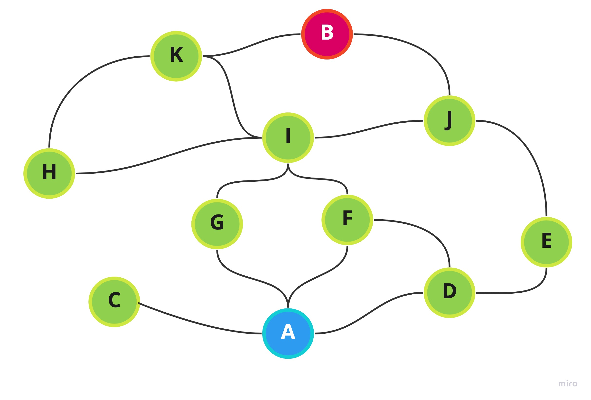

## Primeras ideas

Dos posibles soluciones:

1. Backtracking: Explora todos las soluciones posibles, similar a DFS, busca en todos los nodos hijos y nietos, hace la complejidad mas grande, no escala tan bien
2. Breadth-first search: Camino mas corto, explora todos los nodos hijos antes de moverse a los nietos

See:
https://en.wikipedia.org/wiki/Lee_algorithm

>The Lee algorithm is one possible solution for maze routing problems based on breadth-first search. It always gives an optimal solution

## Proof of concept | primera (y ultima?) solución

El algoritmo de Lee es de los mas conocidos en cuanto a problemas de "laberintos" y usa BFS. Por lo que esta solución sera similar en cuanto a eso.

❌ Backtracking nos dara una complejidad mas grande en tiempo.


✅ Mientras que BFS nos dara una complejidad mas grande en espacio, pero menos en tiempo.

Primero necesitariamos una representacion no-grafica del laberinto, como vamos a usar BFS, la representacion seria en nodos/grafo para poder trabajar programaticamente con el laberinto.





Este grafo queda asi:

```
laberinto = {
    'A': ['C', 'G', 'F', 'D'],
    'B': ['K', 'I', 'J'],
    'C': ['A'],
    'D': ['A', 'F', 'E'],
    'E': ['D', 'J'],
    'F': ['A', 'I', 'D'],
    'G': ['A', 'I'],
    'H': ['I', 'K'],
    'I': ['G', 'K', 'H', 'F', 'J'],
    'J': ['I', 'B', 'E'],
    'K': ['B', 'I', 'H']
}
```

### Implementacion de Maze y Node

```
|==============|
|     Maze     |
|==============|
|Atributos     |
|==============|
|graph: object | # graph with all the nodes and their connections
|value: node   | # will be our maze's entry and each of the node's value
|parent: Maze  | # parent of the current node
|==============|
|Metodos       |
|==============|
|isEqual(node) | # is current node equals another node
|isExit(string)| # check if the current node is the exit
|extend()      | # extends the current node
|findPath()    | # finds the full path, easier to log
|toString()    | # returns the solution of the maze, easier to log
|==============|
```

### Implementacion de BFS

```
|==============|
|     BFS      |
|==============|
|Atributos     |
|==============|
|graph: Maze   | # the graph we'll work with
|exit: string  | # The exit target of the maze we want to find
|stack: array  | # initialized with the graph
|checked: array| # nodes that we've visited
|path: array   | # entry to exit 
|==============|
|Metodos       |
|==============|
|insert(node)  | # inserts node into stack
|remove()      | # removes first node from stack and added to checked
|isEmpty()     | # check if stack is empty
|search()      | # bfs algorithm
|==============|
```

### Respuesta

Al final el codigo deberia logear:

```
A -> G -> I -> K -> B 
Path length: 4
```

## Segunda revision

Ahora que sabemos que la prueba de concepto funciona podemos hacer algunas mejoras

1. Cambiamos stack por una cola, tradicionalmente es mas apropiado para BFS
2. Podemos usar un Hash Set para los nodos que ya visitamos, para fines teoricos nos provee mejor optimizacion en cuanto a tiempo en comparacion a `.includes()` y evitamos visitar el mismo nodo varias veces
3. Para evitar algun edge case, mejor seria cambiar `while(true)` por alguna condicion que termine el loop
4. Vamos a retornar la solucion en vez de logearla
5. Mejor lectura del codigo